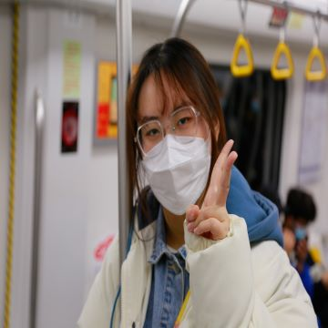
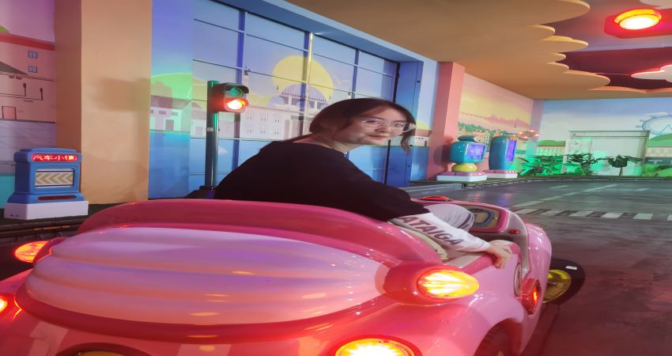

#liuoker.github.io
<!DOCTYPE html>
<html lang="en">
  <head>
    <!-- Basic Page Needs
    ================================================== -->
    <meta charset="u8">
    <!--[if IE]><meta http-equiv="x-ua-compatible" content="IE=9" /><![endif]-->
    <meta name="viewport" content="width=device-width, initial-scale=1">
    <title>和楚楚屁蛋的专属空间</title>
    <meta name="description" content="">
    <meta name="keywords" content="portfolio, agency, bootstrap theme, mobile responsive, template, personal">
    <meta name="author" content="webthemez.com">
    
    <!-- Favicons
    ================================================== -->
    <link rel="shortcut icon" href="" type="image/x-icon"> 

    <!-- Bootstrap -->
    <link rel="stylesheet" type="text/css"  href="css/bootstrap.css">
    <link rel="stylesheet" type="text/css" href="fonts/font-awesome/css/font-awesome.css">

    <!-- Nivo Lightbox
    ================================================== -->
    <link rel="stylesheet" href="css/nivo-lightbox.css" >
    <link rel="stylesheet" href="css/nivo_lightbox_themes/default/default.css">

    <!-- Slider
    ================================================== -->
    <link href="css/owl.carousel.css" rel="stylesheet" media="screen">
    <link href="css/owl.theme.css" rel="stylesheet" media="screen">

    <!-- Stylesheet
    ================================================== -->
    <link rel="stylesheet" type="text/css"  href="css/style.css">
    <link rel="stylesheet" type="text/css" href="css/responsive.css">

    <!-- Google Fonts
    ================================================== -->
    <link href='http://fonts.googleapis.com/css?family=Lato:100,300,400,700,900,100italic,300italic,400italic,700italic,900italic' rel='stylesheet' type='text/css'>

    

    <!-- HTML5 shim and Respond.js for IE8 support of HTML5 elements and media queries -->
    <!-- WARNING: Respond.js doesn't work if you view the page via file:// -->
    <!--[if lt IE 9]>
      
      
    <![endif]-->
  </head>
  <body>

    <!-- Main Navigation 
    ================================================== -->
    <nav id="menu" class="navbar navbar-default navbar-fixed-top">
        

            <!-- Brand and toggle get grouped for better mobile display -->
            

              <button type="button" class="navbar-toggle collapsed" data-toggle="collapse" data-target="#bs-example-navbar-collapse-1">
                Toggle navigation
                
                
                
              </button>
              
            

            <!-- Collect the nav links, forms, and other content for toggling -->
            

              <ul class="nav navbar-nav navbar-right">
                <li><a href="#home" class="scroll">你是</a></li>
                <li><a href="#whatIdo" class="scroll">我最</a></li>
                <li><a href="#about" class="scroll">爱的</a></li>
                <li><a href="#works" class="scroll">超级</a></li>
                <li><a href="#experience" class="scroll">无敌</a></li> 
                <li><a href="#contact" class="scroll">大宝贝！</a></li>
              </ul>
            
<!-- /.navbar-collapse -->
        
<!-- /.container-fluid -->
    </nav>

    <!-- Home Section
    ================================================== -->
    <section id="home">
        
 <!-- Overlay Color -->
            
 <!-- container -->
                
 <!-- Input Your Home Content Here -->
                    <h1>你好呀 
                    这是我给你的小礼物</h1>
                    
可能跟别人的520礼物比这个算不上啥.

                    <a href="#works" class="scroll goto-btn">点击查看宝贝</a> <!-- Link to your portfolio section -->
                
<!-- End Input Your Home Content Here -->
            
 <!-- end container -->
        
<!-- End Overlay Color -->
    

    <!-- Intro Section
    ================================================== -->
    <section id="intro">
        
 <!-- container -->
            
 <!-- row -->

                
 
                        <h1>好好爱一个小胖子</h1>
                    
啵啵啵啵啵啵啵啵啵啵啵啵啵啵啵啵

                

                
            
<!-- end row -->
        
<!-- end container -->
    </section>

    <!-- Service Section
    ================================================== -->
    <section id="whatIdo">
        
 <!-- container -->

            

                <h2>小胖胖的<strong>大事记！</strong></h2>
                <h5><em>Small 卡哇伊のbig thing 记</em></h5>
                

            

            
 <!-- row -->
                
                
  <!-- Left Content Col 6 -->
                    
                
 <!-- End Left Content Col 6 -->

                
 <!-- Right Content Col 6 -->
				  
                    
 <!-- Service #4 -->
                        

                            <i class="fa fa-star"></i>
                        

                        

                            <h4 class="media-heading">关于亲亲</h4>
                            
2021年5月22日第一次亲亲ლ(°◕‵ƹ′◕ლ)哟

                        

                    
<!-- end Service #4 -->

                    
 <!-- Service #5 -->
                        

                            <i class="fa fa-android"></i>
                        

                        

                            <h4 class="media-heading">2021.04.23</h4>
                            
我们在一起啦~~~~~~~~~~么么么么么么嘬嘬嘬嘬嘬嘬嘬嘬嘬

                        

                    
 <!-- end Service #5 -->

                    
 <!-- Service #6 -->
                        

                            <i class="fa fa-apple"></i>
                        

                        

                            <h4 class="media-heading">关于以后</h4>
                            
要带你去很多地方玩，带你吃好多好多好吃的。我带你从我的小学走到我的高中，带你认识我的以前~你也要带我去认识认识你的过去哟~~~

                        

                    
 <!-- end Service #6 -->
                
<!-- end Right Content Col 6 -->
                
            
<!-- end row -->

        
<!-- end container -->
    </section>

    <!-- About Us Section
    ================================================== -->
	
	<section id="about">
 
 <!-- container -->
            

                <h2>这是我的宝贝<strong>王楚蛋子</strong></h2>
                <h5><em>傻不愣的气人小可爱蛋子.</em></h5>
                

            

        
<!-- end container -->	
	

	
		

			

				
			

			

				<h1>Hello,这是我的宝贝.</h1>
				
这是我的宝贝孩子王楚，人小脾气大，喜欢吃辣不喜欢吃酸，喜欢芝士喜欢熟的榴莲，喜欢慕斯喜欢安慕希，不喜欢吃鱼但是喜欢吃半天妖。这小死孩子想要口红眼影眼线笔。害怕一个人睡觉，小怂蛋一个。但是我喜欢这个小怂蛋，可可爱爱的小猪蛋子小屁孩。我爱你ლ(′◉❥◉｀ლ)

				
			

		
<!--End row -->
		
	
<!--End container -->
	
            

                

                    
 <!-- Row -->
                      

					   
 我是王楚小淘气，面对世界很好奇，我有问题数不清咕叽咕叽冒不停~为什么珂珂爱傻逼，为什么小胖子爱生气，为什么珂珂要听话，为什么胖胖可爱闹不停~

						 
 
					    
<!-- right content col 6 -->
                        
 <!-- right content wrapper -->
 
                            
                            
 <!-- skills progress bar -->  

                                
 <!-- skill #4 -->
                                    
魅力值！

                                    

                                        

                                            70% Complete
                                        

                                    

                                
 <!-- end skill #4 -->

                                
 <!-- skill #5 -->
                                    
武力值！

                                    

                                        

                                            50% Complete
                                        

                                    

                                
<!-- end skill #4 -->
                            
 <!-- end skills progress bar -->

                        
<!-- end right content wrapper -->
                    
<!-- end right content col 6 -->
                       
                      
 <!-- End Row -->
					    

						      
 

                          
<!-- counter #1 -->
                            
 
                                <i class="fa fa-mobile"></i>
                                <h4 class="count">520</h4>
                                
我想对你说！

                            
 
                          
<!-- end counter #1 -->

                          
<!-- counter #2 -->
                            

                              <i class="fa fa-user"></i>
                              <h4 class="count">5200</h4>
                              
我们以后会吃多少东西？

                            

                          
 						  
                          
 <!-- counter #3 -->
                            

                              <i class="fa fa-arrows"></i>
                              <h4 class="count">52000</h4>
                              
我们会有多少小孩？

                            

                          

                          
 <!-- counter #4 -->
                            

                              <i class="fa fa-download"></i>
                              <h4 class="count">999999999999999</h4>
                              
我们还会在一起多久？

                            

                          

 
                          

                        

                

            

</section>
	 
    <!-- Works Section
    ================================================== -->
    <section id="works">
        

            

                <h2>你的可爱照片</h2>
                <h5><em>Some you very very very very very QQQQQQQのphotos~</em></h5>
                

            

            

                <ul class="list-inline cat"> <!-- Portfolio Filter Categories -->
                    <li><a href="#" data-filter="*" class="active">你</a></li>
                    <li><a href="#" data-filter=".brand">是</a></li>
                    <li><a href="#" data-filter=".web">我</a></li>
                    <li><a href="#" data-filter=".app">的</a></li>
                    <li><a href="#" data-filter=".others">宝er</a></li>
                </ul><!-- End Portfolio Filter Categories -->
            

        
<!-- End Container -->

        
 <!-- fluid container -->
             
 <!-- Portfolio Wrapper Row -->

                
 <!-- Works #1 col 3 -->
                    
 
                        

                            

                                <a title="Logo Identity Design" href="img/portfolio/01.jpg" data-lightbox-gallery="gallery1" data-lightbox-hidpi="img/portfolio/01.jpg">
                                    <i class="fa fa-expand"></i>
                                </a>
                                <a href="#"><i class="fa fa-chain"></i></a> <!-- change # with your url to link it to another page -->
                            
 
                             <!-- Portfolio Image -->
                        

                    

                
<!-- end Works #1 col 3 -->

                
 <!-- Works #2 col 3 -->
                    

                        

                            

                                <a title="Mobile Application" href="img/portfolio/02.jpg" data-lightbox-gallery="gallery1" data-lightbox-hidpi="img/portfolio/02.jpg">
                                    <i class="fa fa-expand"></i>
                                </a>
                                <a href="#"><i class="fa fa-chain"></i></a><!-- change # with your url to link it to another page -->
                            

                             <!-- Portfolio Image -->
                        

                    

                
<!-- end Works #2 col 3 -->

                
<!-- Works #3 col 3 -->
                    

                        

                            

                                <a title="Freedom Project #1" href="img/portfolio/03.jpg" data-lightbox-gallery="gallery1" data-lightbox-hidpi="img/portfolio/03.jpg">
                                    <i class="fa fa-expand"></i>
                                </a>
                                <a href="#"><i class="fa fa-chain"></i></a><!-- change # with your url to link it to another page -->
                            

                             <!-- Portfolio Image -->
                        

                    

                
<!-- end Works #3 col 3 -->

                
 <!-- Works #4 col 3 -->
                    

                        

                            

                                <a title="Freedom Project #1" href="img/portfolio/04.jpg" data-lightbox-gallery="gallery1" data-lightbox-hidpi="img/portfolio/04.jpg">
                                    <i class="fa fa-expand"></i>
                                </a>
                                <a href="#"><i class="fa fa-chain"></i></a><!-- change # with your url to link it to another page -->
                            

                             <!-- Portfolio Image -->
                        

                    

                
 <!-- end Works #4 col 3 -->

                
 <!-- Works #5 col 3 -->
                    

                        

                            

                                <a title="Freedom Project #1" href="img/portfolio/05.jpg" data-lightbox-gallery="gallery1" data-lightbox-hidpi="img/portfolio/05.jpg">
                                    <i class="fa fa-expand"></i>
                                </a>
                                <a href="#"><i class="fa fa-chain"></i></a><!-- change # with your url to link it to another page -->
                            

                             <!-- Portfolio Image -->
                        

                    

                
 <!-- end Works #5 col 3 -->

                
  <!-- Works #6 col 3 -->
                    

                        

                            

                                <a title="Freedom Project #1" href="img/portfolio/06.jpg" data-lightbox-gallery="gallery1" data-lightbox-hidpi="img/portfolio/06.jpg">
                                    <i class="fa fa-expand"></i>
                                </a>
                                <a href="#"><i class="fa fa-chain"></i></a><!-- change # with your url to link it to another page -->
                            

                             <!-- Portfolio Image -->
                        

                    

                
<!-- end Works #6 col 3 -->

                
<!-- Works #7 col 3 -->
                    

                        

                            

                                <a title="Freedom Project #1" href="img/portfolio/07.jpg" data-lightbox-gallery="gallery1" data-lightbox-hidpi="img/portfolio/07.jpg">
                                    <i class="fa fa-expand"></i>
                                </a>
                                <a href="#"><i class="fa fa-chain"></i></a><!-- change # with your url to link it to another page -->
                            

                             <!-- Portfolio Image -->
                        

                    

                
<!-- end Works #7 col 3 -->

                
 <!-- Works #8 col 3 -->
                    
 
                        

                            

                                <a title="Freedom Project #1" href="img/portfolio/08.jpg" data-lightbox-gallery="gallery1" data-lightbox-hidpi="img/portfolio/08.jpg">
                                    <i class="fa fa-expand"></i>
                                </a>
                                <a href="#"><i class="fa fa-chain"></i></a><!-- change # with your url to link it to another page -->
                            

                             <!-- Portfolio Image -->
                        
 
                    

                
 <!-- end Works #8 col 3 -->
                
            
 <!-- End Row -->

        
 <!-- End Container-Fluid -->
    </section>

    <!-- experience Section
    ================================================== -->
    <section id="experience">
        
 <!-- container -->
            

                <h2>我叫王楚楚蛋</h2>
                <h5><em>My name is very beauty baby</em></h5>
                

            

        
<!-- end container -->

        
 <!-- fullwidth gray background -->
            
<!-- container --> 
                
 <!-- row -->

                    

                        
 <!-- experience #1 -->
                            

                                <i class="fa fa-facebook"></i>
                            

                            

                                <h4 class="media-heading">嗨！听俺说！</h4>
								<h5>(๑′ᴗ‵๑)Ｉ Lᵒᵛᵉᵧₒᵤ❤</h5>
                                
以前不吃酸甜，可是遇到你之后才知道什么是甜，什么是酸，见到你就说甜，不见你就说酸

                            

                        
<!-- experience #1 -->

                        
 <!-- experience #2 -->
                            

                                <i class="fa fa-google-plus"></i>
                            

                            

                                <h4 class="media-heading">你好！楚楚宝</h4>
								<h5>(●´З｀●)</h5>
                                
有好多话想对你说，想说我很在乎你，我总是学不会用什么方式去爱你。请原谅我是一个不会表达的人，每天一句小情话或者是自己喜欢的句子。不知道能坚持多久，也不知道最后会是什么样的结果，只希望可以永远跟你在一起，可以爱着你，陪着你。

                            

                        
<!-- experience #2 -->

                        
 <!-- experience #3 -->
                            

                                <i class="fa fa-yahoo"></i>
                            

                            

                                <h4 class="media-heading">宝贝好好听我嗦~</h4>
								<h5>（づ￣3￣）づ╭❤～</h5>
                                
希望你新鲜感过后 能好好跟我说 我们可以好好谈一谈 因为我真的很爱你 不想知道我多爱你 并不是在嘴上说说而已 希望每一天都快乐 我想我希望往后余生我们一起走 我希望我们之间无论发生了什么都要一起挺过来 也希望我们之间出现的种种矛盾我们一起解决 我希望你有什么事都可以告诉我我希望我们之间没有任何隔阂 因为是你 所以没道理放弃爱你。

                            

                        
<!-- experience #3 -->

                        
 <!-- experience #4 -->
                            

                                <i class="fa fa-linkedin"></i>
                            

                            

                                <h4 class="media-heading">我要带你到处旅游！</h4>
								<h5>好好的爱这个世界！</h5>
                                
生活有时不尽如人意。我们挣扎哭泣，有时甚至放弃。但我们心中始终知道它的可爱。人生，就是一次旅行，每去到一个地方都是一种领悟。风雨的路有沉默有露重;生活的路有拼搏有辛苦;爱情的路有凄楚有情浓;心情的路有快乐有伤痛。回望走过得路，是生命的一种体会，是经历的一种可贵，是人生的一种无悔。希望我的宝贝每天都要乐观的去生活~去爱这个世界！积极乐观的去迎接困难~就算有你解决不了的问题，你要记得你还有我~(づ｡◕‿‿◕｡)づ

                            

                        
<!-- experience #4 -->
                        
                    

                
 <!-- end row -->
            
<!-- end container -->
        
  <!-- end fullwidth gray background -->
    </section>

    
    <!-- Contact Section
    ================================================== -->
    <section id="contact">

        
 <!-- container -->
            

                <h2>在哪里能联系到超级无敌巨帅气的刘珂呢？</h2>
                <h5><em>Lorem Ipsum is simply dummy text of the printing and typesetting industry</em></h5>
                

            

        
<!-- end container -->
 
        
<!-- container -->
            
 <!-- outer row -->
                
 <!-- col 10 with offset 1 to centered -->
                    
 <!-- nested row -->

                        <!-- contact detail using col 4 -->
                        
  
                            

                                <i class="fa fa-map-marker"></i>
                                <h4>❤在楚宝心里❤</h4> <!-- address -->
                            

                        

                        <!-- contact detail using col 4 -->
                        

                            

                                <i class="fa fa-envelope-o"></i>
                                <h4>liuoker❤wangchu@999.com</h4><!-- email add -->
                            

                        

                        <!-- contact detail using col 4 -->
                        

                            

                                <i class="fa fa-phone"></i>
                                <h4>+5205205520</h4> <!-- phone no. -->
                            

                        

                    
 <!-- end nested row -->
                
 <!-- end col 10 with offset 1 to centered -->
            
<!-- end outer row -->

            
 <!-- contact form outer row with centered text-->
                
 <!-- col 10 with offset 1 to centered -->
                    <form id="contact-form" class="form" name="sentMessage" novalidate> <!-- form wrapper -->

                        
 <!-- nested inner row -->

                            <!-- Input your name -->
                            

                                
 <!-- Your name input -->
                                    <input type="text" autocomplete="off" class="form-control" placeholder="Your Name *" id="name" required data-validation-required-message="Please enter your name.">
                                    

                                

                            

                            <!-- Input your email -->
                            

                                
 <!-- Your email input -->
                                    <input type="email" autocomplete="off" class="form-control" placeholder="Your Email *" id="email" required data-validation-required-message="Please enter your email address.">
                                    

                                

                            

                            <!-- Input your Phone no. -->
                            

                                
 <!-- Your email input -->
                                    <input type="text" autocomplete="off" class="form-control" placeholder="Your Phone No. *" id="phone" required data-validation-required-message="Please enter your phone no.">
                                    

                                

                            

                        
<!-- end nested inner row -->

                        <!-- Message Text area -->
                        
 <!-- Your email input -->
                            <textarea class="form-control" rows="7" placeholder="Tell Us Something..." id="message" required data-validation-required-message="Please enter a message."></textarea>
                            

                            

                        

                        <button type="submit" class="btn btn-primary btn color">❤点击发送你的爱❤</button> <!-- Send button -->

                    </form><!-- end form wrapper -->
                
<!-- end col 10 with offset 1 to centered -->
            
 <!-- end contact form outer row with centered text-->

        
<!-- end container -->

    </section>

    <!-- Footer 
    ================================================== -->
    <section id="footer">
        
<!-- container -->
		 <ul class="list-inline social pull-left">
                <li><a href="#"><i class="fa fa-facebook"></i></a></li> <!-- Change # With your FB Link -->
                <li><a href="#"><i class="fa fa-twitter"></i></a></li> <!-- Change # With your Twitter Link -->
                <li><a href="#"><i class="fa fa-google-plus"></i></a></li> <!-- Change # With your Google Plus Link --> 
                <li><a href="#"><i class="fa fa-behance"></i></a></li> <!-- Change # With your Behance Link -->
                <li><a href="#"><i class="fa fa-linkedin"></i></a></li> <!-- Change # With your LinkedIn Link --> 
            </ul>
            
相信你爹会爱你一辈子哟~~~❤❤❤<a href="https://webthemez.com/free-bootstrap-templates/" target="_blank">相信我会一直好好爱你哟（づ￣3￣）づ╭❤～</a> by 你最爱的liuoker爹爹
 <!-- copyright text here-->
           
        
<!-- end container -->
    </section>
    

    <!-- jQuery (necessary for Bootstrap's JavaScript plugins) -->
    
    
    <!-- Include all compiled plugins (below), or include individual files as needed -->
    

    <!-- Owl Carousel Plugin -->

     

    <!-- Parallax Effects -->
    
    

    <!-- 点击查看可爱 Filter -->
    

    <!-- LightBox Nivo -->
    

    <!-- Contact page-->
    
    

    <!-- Javascripts
    ================================================== -->
    

  </body>
</html>
